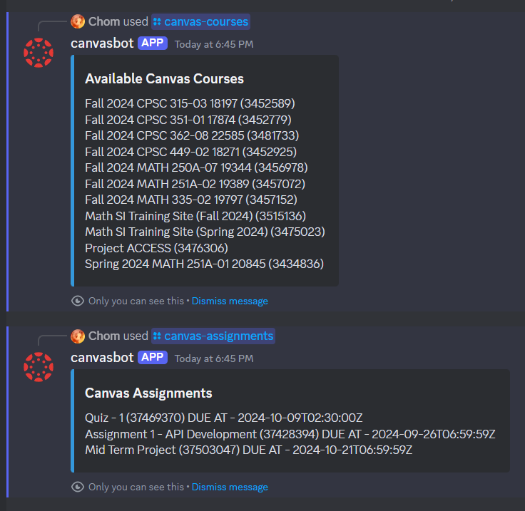

# canvasbot

Discord slash commands that utilize the Canvas API to retrieve course information and assignments! This repository demonstrates how to leverage the Discord development platform to connect with different services and build useful and meaningful applications (example from [acmcsufoss](https://github.com/acmcsufoss)'s Fall 2024 Discord Workshop).

> [!NOTE]
> Check out [Owen's](https://github.com/JOwen-ster/Discord.py-Bot-TEMPLATE) Discord Bot Template for a more complete, scalable solution.


## Installation / Development

### Clone this repository

- [x] HTTPS
```
git clone https://github.com/tomasohCHOM/canvasbot.git
```

- [X] SSH
```
git clone git@github.com:tomasohCHOM/canvasbot.git
```

- [X] GitHub CLI
```
gh repo clone tomasohCHOM/canvasbot.git
```

Once you have the repository cloned, follow the instructions in [this README](https://github.com/JOwen-ster/Discord.py-Bot-TEMPLATE?tab=readme-ov-file#creating-your-application) to:
- Configure the Discord bot in the development portal
- Retrieve the Canvas API key
- Set up your local development environment (installing dependencies)

## End result

If everything is configured correctly, you should be able to interact with the slash commands. Type `/` in a Discord channel’s textbox and confirm that the `canvas-courses` and `canvas-assignments` commands are functioning as expected!



---

Developed with 💚 by [Tomas](https://github.com/tomasohCHOM), [Owen](https://github.com/JOwen-ster), and the [acmcsufoss](https://github.com/acmcsufoss) team!